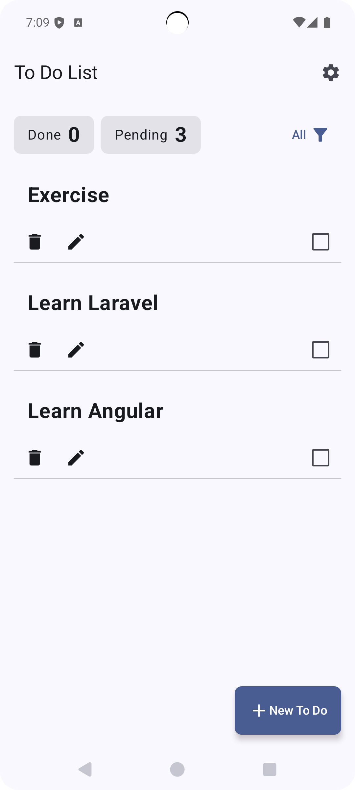
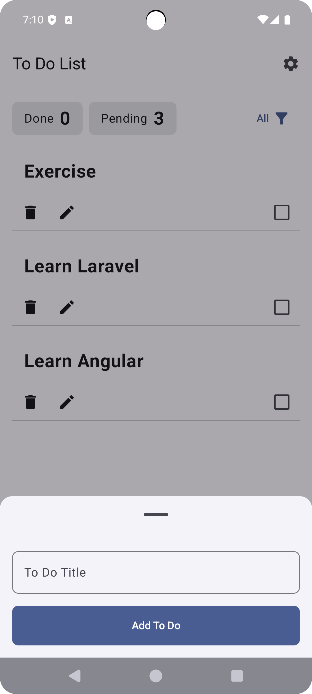
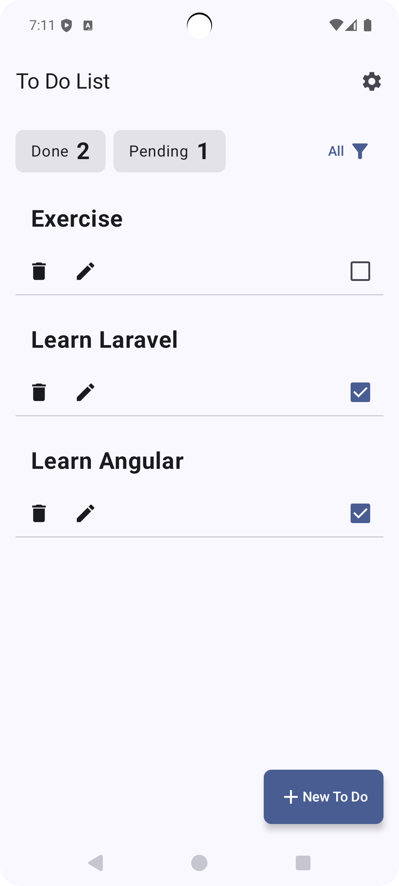
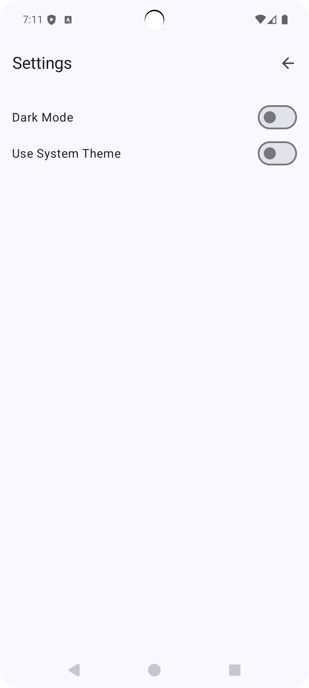
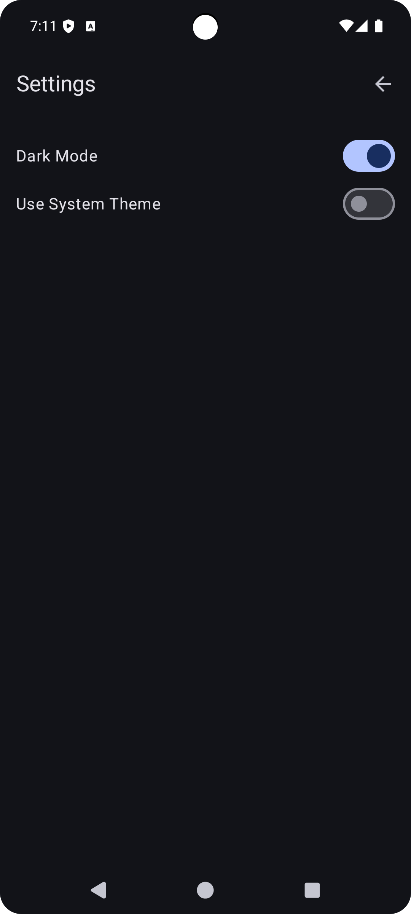
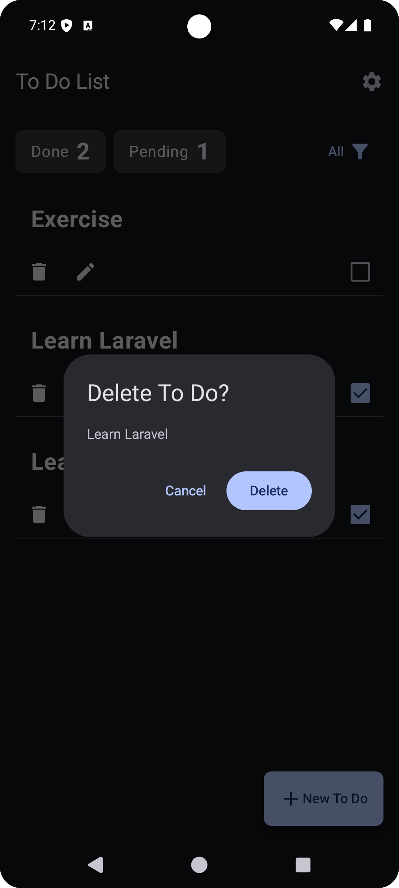

# ToDoList

A simple Android To-Do List app built with **Kotlin** to experiment with modern Android development
patterns such as **MVVM**, **Hilt**, **Room**, and **Jetpack Compose**.
This project was created as a learning and testing ground, but it is fully functional with basic
CRUD features.

## Features

- Add, update, and delete to-do items
- Mark tasks as done/pending
- Simple UI built with Jetpack Compose and Material3
- Local persistence with Room database
- Theme preference stored using DataStore

## Screenshots

<p style="text-align: center;">
  
  
  
  
  
  
  
</p>

## Tech Stack

- **Language:** Kotlin
- **UI:** Jetpack Compose, Material3
- **Architecture:** MVVM + Clean Architecture (Maybe?)
- **Dependency Injection:** Hilt
- **Persistence:** Room Database, DataStore Preferences

## Project Structure

- `domain/` — Models, repository interfaces, use cases
- `data/` — Local data sources, repository implementations
- `presentation/` — Compose UI, screens, viewmodels
- `di/` — Dependency injection modules

## Getting Started

### Prerequisites

- Android Studio (latest stable version recommended)
- JDK 17 or higher

### Installation & Running

1. Clone the repository:
   ```bash
   git clone https://github.com/ahmedjamion/todolist.git
   ```
2. Open the project in Android Studio.
3. Let Android Studio sync the project and download the necessary dependencies.
4. Select an emulator or connect a physical device.
5. Click the "Run" button (green play icon) in Android Studio to build and run the app.

## License

This project is licensed under the MIT License - see the [LICENSE.md](LICENSE.md) file for details.
